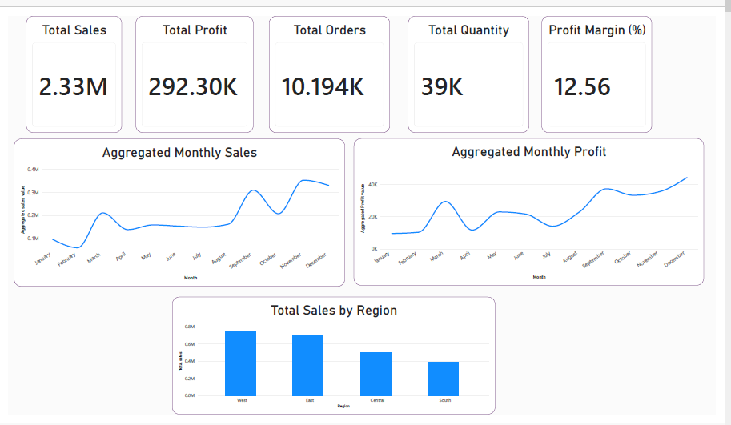
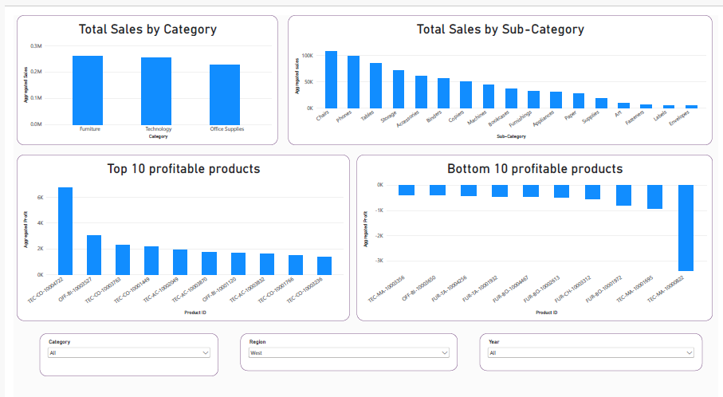
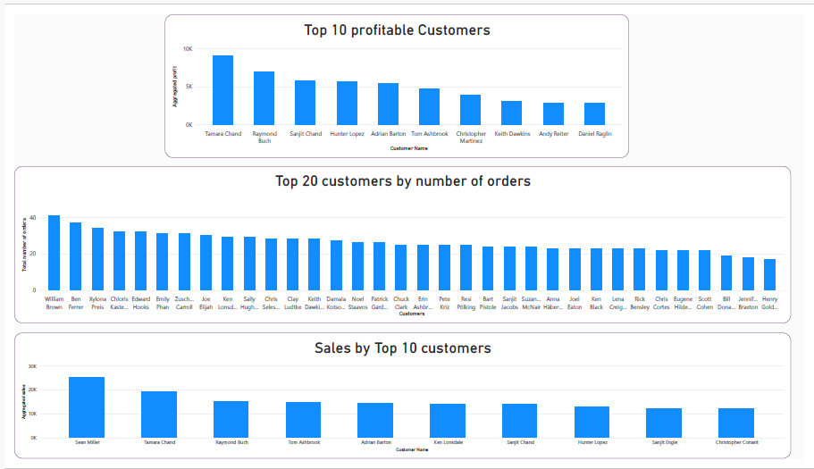
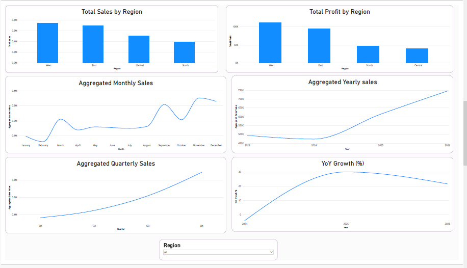

# Business Sales Intelligence & Performance Analytics

## Project Overview
This project simulates the role of a Junior Data Analyst at a US-based retail store that sells products across three categories and seventeen sub-categories. Since product sales are the company's only revenue stream, the goal is to evaluate how the business is performing in terms of sales and profit, identify which products, customers, and regions drive the most value, and provide data-backed recommendations for improvement.

## Dataset
The analysis uses the publicly available **Sample Superstore Dataset** dataset, containing roughly 10,200 rows and 21 columns covering order details, customer information, product categories, sales, discount, and profit figures.

## Tools
- **Python** (Pandas, Matplotlib, Seaborn) — data cleaning and exploratory analysis
- **SQL** — targeted business queries
- **Power BI** — interactive dashboard for yearly sales trends and YoY growth
- **GitHub** — version control and documentation

## Methodology
The project follows a standard analytics workflow:
1. Understand the dataset and how it relates to the business problem
2. Clean and wrangle the data
3. Perform exploratory data analysis (EDA)
4. Answer targeted questions using SQL
5. Build an interactive Power BI dashboard
6. Translate findings into business recommendations

## Data Cleaning
- No missing values or duplicate records were found in the dataset.
- Outlier profit values were investigated using the IQR method. Several large negative-profit outliers were traced to heavy discounts on a handful of expensive one-off items (e.g. 3D printers, an electric binding system) — losses of $3,700–$6,600 on individual orders.
- These outliers were judged plausible rather than data errors, so they were retained rather than removed.
- A discount-vs-profit analysis showed profit stays positive up to roughly a 20% discount, with heavier discounts consistently producing losses.

## Analysis
Key questions explored in Python and SQL:
- How do monthly and yearly sales trend across product categories, and is there seasonality?
- Which regions generate the most profit, and why?
- Who are the most valuable customers by profit (as opposed to by raw sales)?
- Which products and sub-categories are most and least profitable?
- How does discount level relate to profitability?
- What is the year-over-year sales growth rate?

Findings included a clear seasonal pattern (sales peaking around March and September–November), technology consistently leading in sales, and 3 of 17 sub-categories (bookcases, supplies, tables) operating at a loss.

## Dashboard
The Power BI dashboard mirrors the EDA findings and adds a dedicated view of yearly aggregated sales and YoY growth. Sales dipped in 2024, then growth rebounded sharply to ~30% in 2025 before easing to ~21% in 2026 — a pattern consistent with an early-stage business absorbing startup costs before scaling.






## Key Insights
1. Overall the business shows healthy growth, but it operates in a highly saturated US retail market alongside major competitors (Staples, Office Depot, W.B. Mason).
2. Current profit margin sits around 13% — solid, but with clear room for improvement.
3. Sales and profit follow a seasonal pattern, peaking in March, September, and November.
4. East and West are the strongest regions by profit, driven by higher sales volume, lower average discounting, and dominant states (California, New York).
5. Central has the weakest profit margin, linked to its notably heavier discounting (up to 80%, averaging 24%).
6. Technology leads in sales, but furniture generates disproportionately low profit due to steep discounts (up to 70%, averaging 17%).
7. The top customers by sales and by profit are largely different people — high-volume buyers don't always translate into high-profit customers.
8. 90% of the bottom 10 products by profit carry discounts in the 20–53% range, reinforcing the link between heavy discounting and losses.

## Recommendations
1. Shift growth focus toward the Central and South regions rather than competing harder in the already well-served East and West.
2. Cap standard discounting around 10–20%, since profit data shows this range (particularly near 20%) is where profitability is strongest.
3. Reassess furniture pricing and reduce discounting on the category, or introduce a higher-quality, higher-margin furniture line.
4. Review or discontinue chronically loss-making sub-categories (bookcases, supplies, tables), or remove discounting on them after a closer look at their cost of goods sold.
5. Introduce loyalty programs and targeted promotions to convert frequent buyers into higher-profit customers, since current top spenders aren't necessarily the most profitable.
6. Explore long-term category expansion (e.g. home furniture, workwear) to reach underserved regions, testing before full rollout.

## How to Run
1. Clone the repository:
   ```bash
   git clone https://github.com/joedinar/Business-Sales-Intelligence.-.git
   ```
2. Install the required Python packages:
   ```bash
   pip install -r requirements.txt
   ```
3. Open `notebooks/EDA.ipynb` to review the data cleaning and exploratory analysis.
4. Run the queries in `sql/analysis_queries.sql` against the dataset in your SQL tool of choice.
5. Open `powerbi/sales_dashboard.pbix` in Power BI Desktop to explore the interactive dashboard.
6. See `reports/business_insights.pdf` for the full detailed write-up of findings and recommendations.
